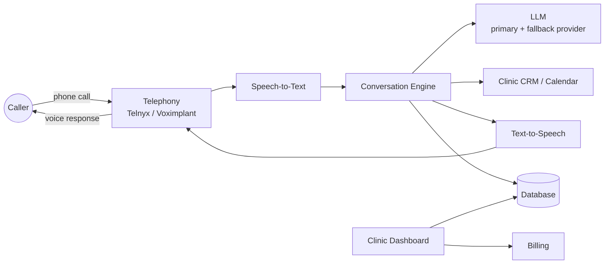

# Architecture — top-level overview

This is a high-level view of how a call flows through the system and how the
product is put together. It intentionally stops at the level of "which
services talk to which" — conversation logic, prompt design, and internal
call-handling details are not part of this repo.

## Call flow

## Components

- **Telephony** — inbound/outbound call handling, region-appropriate provider
  (EU/US and Russia use different carriers for coverage and compliance).
- **Speech-to-Text** — streaming transcription of the caller's audio.
- **Conversation Engine** — turns transcribed speech into the next action:
  ask a follow-up question, look up availability, book/reschedule/cancel, or
  hand off. This is the proprietary core of the product and is not detailed
  here.
- **LLM layer** — a primary provider with an automatic fallback provider, so
  a single vendor outage doesn't take the phone line down.
- **CRM / Calendar integration** — reads and writes appointments directly in
  the clinic's existing system (see [FEATURES_AND_CRM.md](./FEATURES_AND_CRM.md)
  for supported systems).
- **Text-to-Speech** — turns the agent's response back into natural-sounding
  voice, in the clinic's configured language.
- **Dashboard** — where clinic staff review calls, manage their agent, and
  handle billing.
- **Database** — stores clinics, agents, call records and transcripts.

## Infrastructure notes

- Backend and dashboard are hosted separately from the database, in
  different regions chosen for latency and data-residency reasons.
- Personal data (call transcripts) is retained only as text — no call audio
  is stored — and is automatically purged after a clinic-configurable
  retention period.
- The system supports multiple call-handling languages and multiple billing
  currencies, since clinics operate across different countries.
