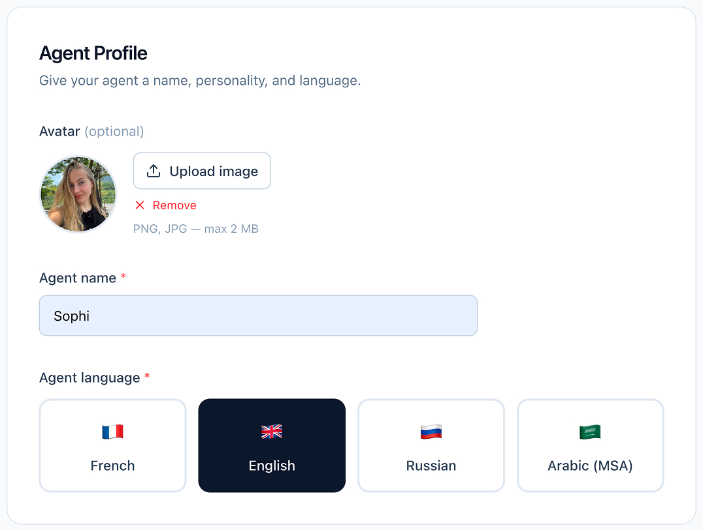
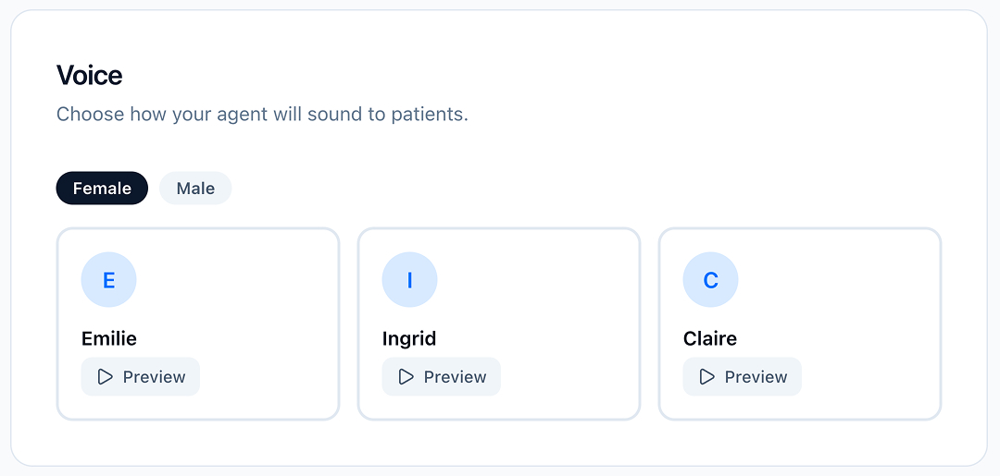
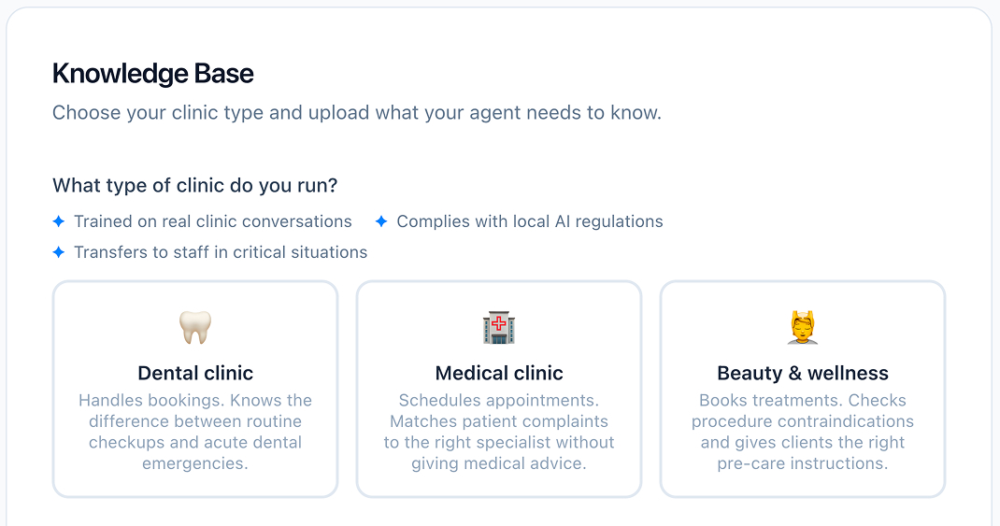
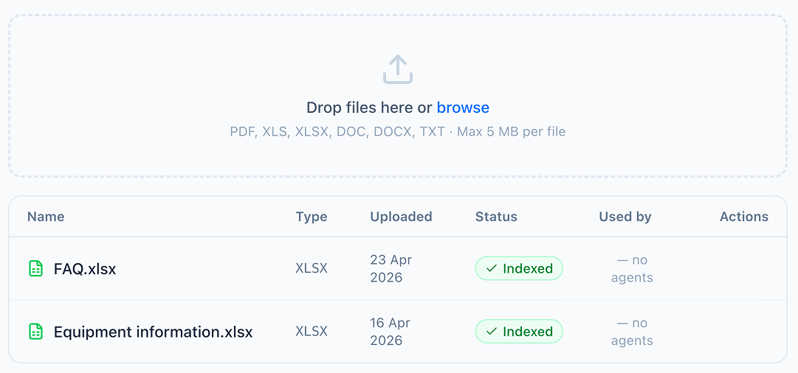
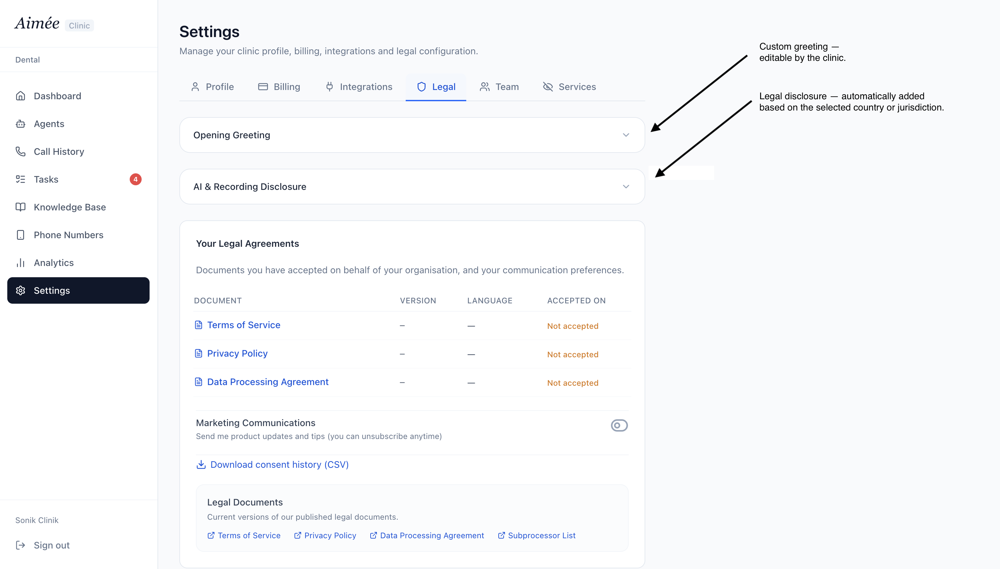
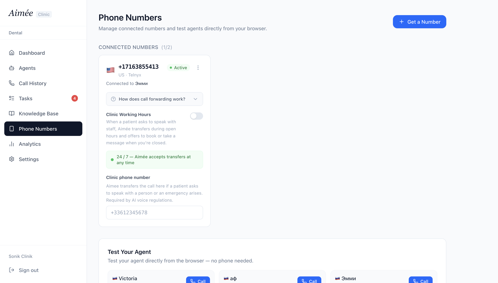
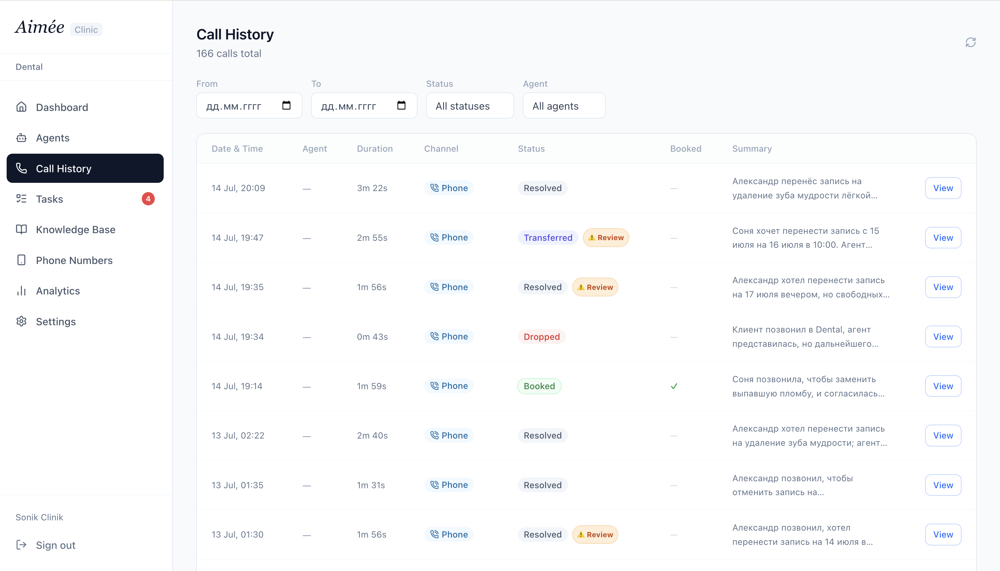
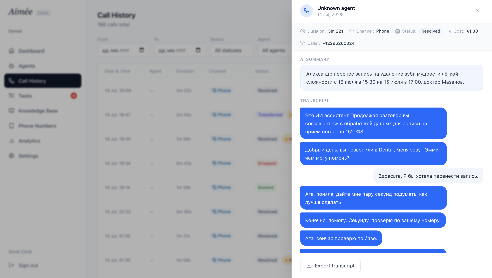
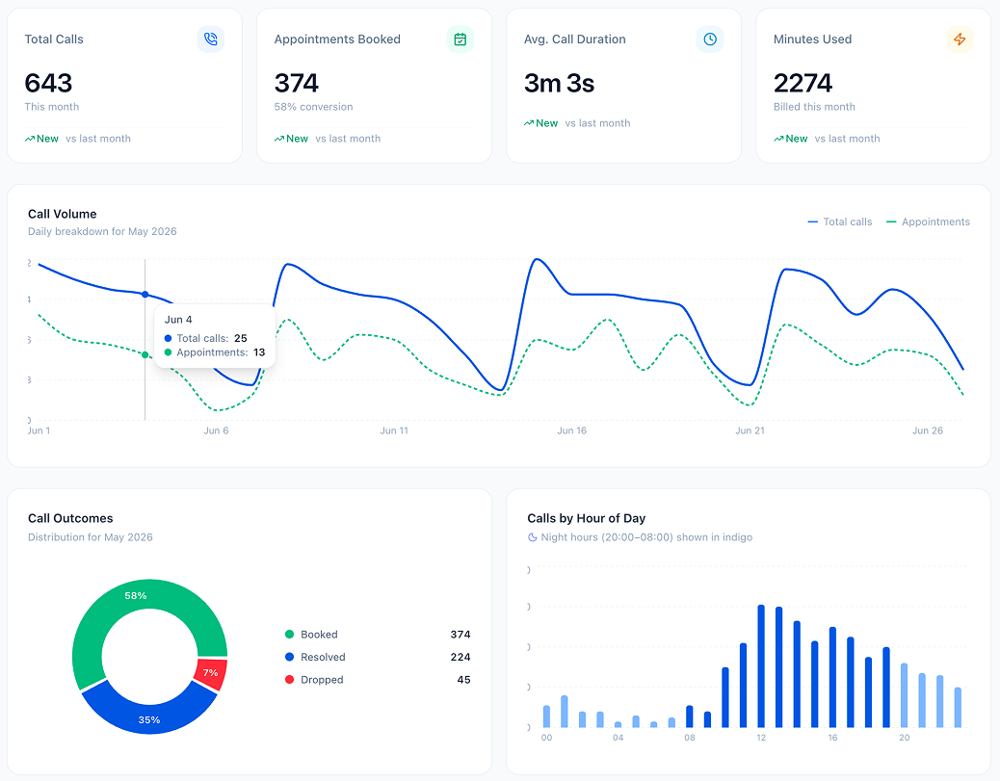
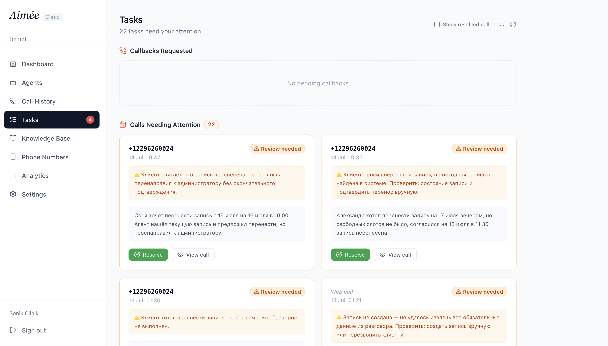

# Screenshots

## Agent creation

| | |
|---|---|
|  | **Step 1 — name & language.** First step of creating a new agent: naming it and choosing the language it speaks with callers. |
|  | **Step 2 — voice.** Choosing the agent's voice. |
|  | **Step 3 — vertical.** Choosing the clinic type the agent is tuned for (Dental / Medical / Beauty), which adapts its behavior and vocabulary. |

## Knowledge base

Where clinic staff upload the documents an agent uses to answer questions —
FAQs and other clinic-specific information (light/simplified view shown here).

## Legal & greeting settings

Two layers clinics can configure: a legal preamble (editable, adapts to the
clinic's jurisdiction) and a greeting layer the agent opens each call with.

## Phone numbers

Where clinics buy and assign phone numbers to their agents.

## Call history

| | |
|---|---|
|  | **List view.** All calls in a filterable table. |
|  | **Detail view.** A single call opened up, with its transcript and outcome. |

## Analytics

Call volume and outcome analytics for the clinic.

## Tasks

Where problem calls land for front-desk staff to review and resolve by
hand — a call that didn't result in a booking, a system error, a scheduling
conflict, or anything else that needs a human to step in.
